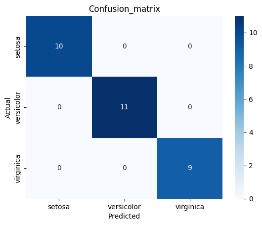

# 🌸 CodeAlpha - Iris Flower Classification

## 📌 Project Overview
This project is part of the **CodeAlpha Data Science Internship**.  
The goal is to build a machine learning model that can classify iris flowers into one of three species — **Setosa**, **Versicolor**, or **Virginica** — based on their sepal and petal measurements.

This task demonstrates basic **classification concepts** in machine learning, including:
- Data loading and preprocessing
- Exploratory Data Analysis (EDA)
- Model training and evaluation
- Result visualization

---

## 📊 Dataset
- **Source**: Built-in `Iris` dataset from Scikit-learn
- **Features**:
  - Sepal Length (cm)
  - Sepal Width (cm)
  - Petal Length (cm)
  - Petal Width (cm)
- **Target**:
  - Setosa
  - Versicolor
  - Virginica

---

## 🛠 Tools & Libraries
- **Programming Language**: Python
- **Libraries**:
  - Pandas
  - NumPy
  - Matplotlib
  - Seaborn
  - Scikit-learn

---

## 🚀 Steps Involved

1. **Load Dataset**
   - Used `load_iris()` from `sklearn.datasets`.
2. **Exploratory Data Analysis**
   - Checked dataset shape, info, and descriptive statistics.
   - Plotted pairplots and correlation heatmaps.
3. **Data Preprocessing**
   - Split dataset into training and testing sets.
   - Scaled features using `StandardScaler`.
4. **Model Training**
   - Used **Logistic Regression** for classification.
5. **Model Evaluation**
   - Calculated accuracy score.
   - Generated confusion matrix and classification report.
   - Visualized confusion matrix using heatmap.

---

## 📈 Model Performance
- **Accuracy**: **100%** on test dataset  
- **Reason**: The Iris dataset is small, clean, and well-separated, making it relatively easy to classify with Logistic Regression.

**Confusion Matrix Heatmap:**

---

## 📂 Repository Structure

CodeAlpha_IrisClassification/
│── iris_classification.ipynb # Colab notebook with code
│── README.md # Project documentation
│── requirements.txt # Python dependencies
│── confusion_matrix.png # Confusion_matrix

---

## ✍ Author
**Ankit Kumar**
CodeAlpha Data Science Intern  
[LinkedIn Profile](https://www.linkedin.com/in/ankit-kumar-476b35378/) | [GitHub Profile](https://github.com/AnkitKumarIISERB)

---
